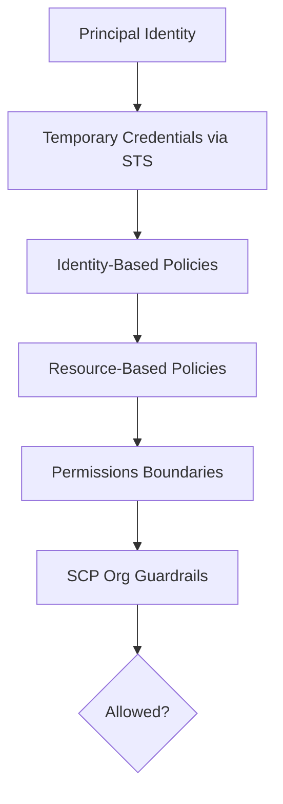

# Page 1 — IAM Foundations (Deep Dive)

## 1. What IAM Actually Is
AWS Identity and Access Management (IAM) governs **authorization** for AWS API actions across every service.

IAM answers one question:

> *“Is this principal allowed to perform this action on this resource?”*

IAM does **not** authenticate users directly — authentication is handled by:

- AWS Management Console  
- AWS Identity Center (SSO)  
- External IdPs (Okta, Entra, Google, Ping)  
- STS (Security Token Service) for CLI/service access  

Once authenticated, the caller receives **temporary credentials**, and IAM evaluates whether the requested action should be allowed.

IAM is built on four key components:

1. **Identity-based policies** — permissions attached to IAM users, groups, roles  
2. **Resource-based policies** — permissions attached directly to resources  
3. **Permission boundaries** — optional maximum permissions for identities  
4. **Role trust policies** — define *who is allowed to assume a role*  

---

## 2. IAM Never Grants Access — It Allows or Denies
IAM is a **policy evaluation engine**, not a grant system.

Final access is:

```
Explicit Deny? → Always No
Otherwise:
    Allowed by IAM?
    Allowed by Resource Policy?
    Allowed by Boundaries?
    Allowed by SCPs?
→ Yes or No
```

---

## 3. IAM Identities

### IAM Users
- Long-lived passwords and access keys  
- High risk  
- Should not be used for humans  
- Should not be used for automation  

### IAM Groups
- Only apply to IAM users  
- Bundle permissions  
- Legacy pattern  

### IAM Roles
Roles are **temporary identities** assumed via STS.

Roles have:
- A trust policy  
- A permissions policy  

Roles are assumed by:
- Humans via SSO  
- AWS services  
- CI/CD pipelines  
- Other AWS accounts  
- EKS IRSA pods  

---

## 4. IAM Evaluation Visualized



---

## 5. Why Temporary Credentials Are the Standard

- Expire automatically  
- Cannot be reused  
- Reduce compromise risk  
- Audited per session  
- Prevent long-lived key leakage risks  

**Permanent access keys should be avoided.**

---

## 6. IAM and Zero Trust

IAM enforces Zero Trust principles by evaluating:

- Identity  
- Context  
- Resource  
- Conditions  
- Org-level guardrails  

AWS identity is inherently Zero Trust aligned.
