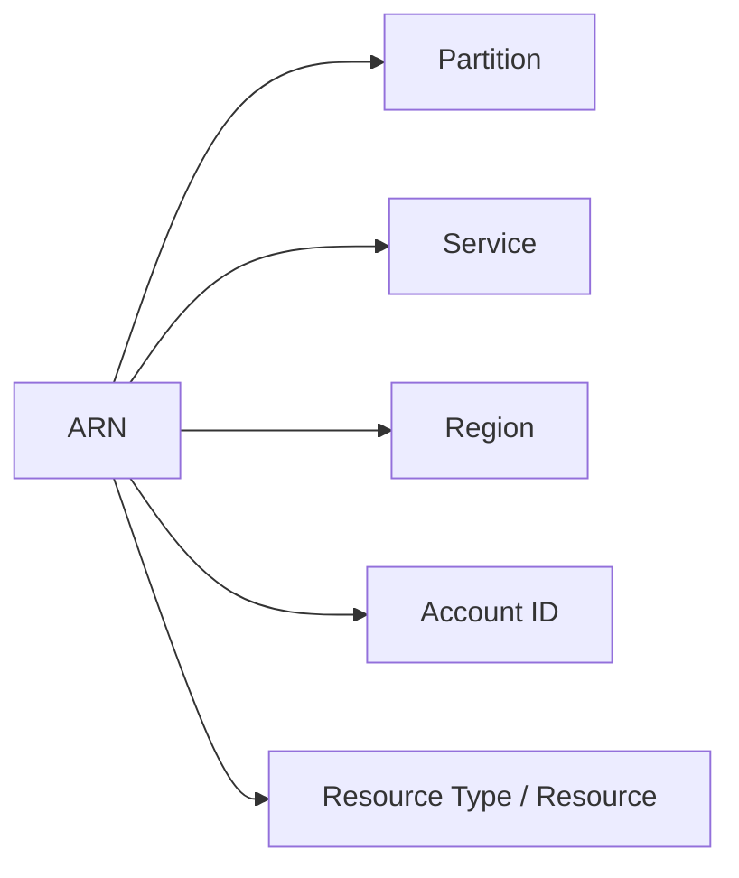

# Page 2 — ARNs (Amazon Resource Names)

## 1. What an ARN Is
Every AWS resource is uniquely identified by an Amazon Resource Name (ARN).  
ARNS are used throughout IAM policies, resource policies, trust relationships, IaC templates, and cross-account permissions.

### General ARN Format
```
arn:partition:service:region:account-id:resource
```

Breakdown:
- **partition** — usually `aws`, sometimes `aws-us-gov`, `aws-cn`
- **service** — e.g., `s3`, `lambda`, `kms`
- **region** — e.g., `us-east-1`
- **account-id** — AWS account number
- **resource** — varies per service (name, path, ID, etc.)

---

## 2. Common ARN Examples

### S3 Bucket
```
arn:aws:s3:::my-company-logs
```

### Specific S3 Object
```
arn:aws:s3:::my-company-logs/app1/file.txt
```

### Lambda Function
```
arn:aws:lambda:us-east-1:123456789012:function:UpdateCustomer
```

### IAM Role
```
arn:aws:iam::123456789012:role/AppServerRole
```

### DynamoDB Table
```
arn:aws:dynamodb:us-east-1:123456789012:table/Orders
```

### KMS Key
```
arn:aws:kms:us-east-1:123456789012:key/abcd-1234-efgh-5678
```

---

## 3. ARN Structure Diagram



---

## 4. ARN Variations

### 1. Simple ARN
```
arn:aws:service:region:acct:resource
```

### 2. Resource-Type ARN
```
arn:aws:service:region:acct:resourcetype/resource
```

### 3. Resource Path ARN
```
arn:aws:service:region:acct:resourcetype/path/to/object
```

### 4. Wildcard ARNs
```
arn:aws:s3:::my-bucket/*
```

Used to express multiple resources within a single policy.

---

## 5. Where ARNs Are Used
ARNS appear throughout AWS, including:

- IAM Policies (`Resource` and `Condition` blocks)
- Resource policies (S3, Lambda, SNS, SQS, KMS)
- Trust policies
- Permission boundaries
- SCPs
- CloudFormation and Terraform templates
- Lambda permissions
- API Gateway integrations
- Step Functions definitions

ARNS are the backbone of AWS identity and authorization because they uniquely define **what** an identity can interact with.

