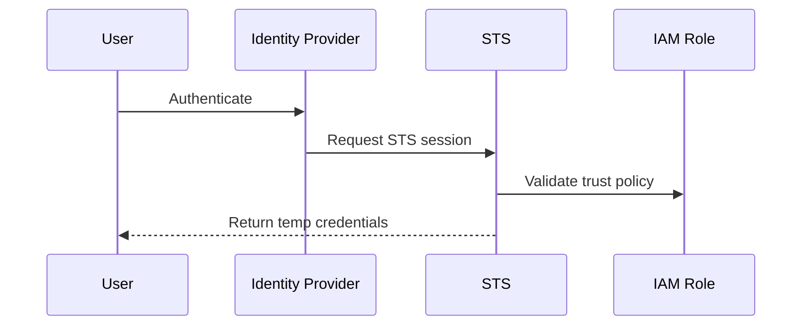

# Page 3 — STS (Security Token Service)

## 1. Purpose of STS
AWS Security Token Service (STS) issues **temporary security credentials** used by nearly all modern AWS identity flows.

Any principal accessing AWS through:
- AWS SSO  
- IAM roles  
- Lambda execution roles  
- EC2 instance profiles  
- ECS task roles  
- EKS IRSA  
- GitHub/GitLab OIDC pipelines  

…is ultimately backed by STS-generated temporary credentials.

Temporary credentials dramatically reduce security risk by:
- Expiring automatically  
- Being unique per session  
- Preventing long-lived credential misuse  
- Supporting MFA enforcement  
- Enabling precise session auditing  

---

## 2. Why Temporary Credentials Are Safer
Temporary credentials eliminate the dangers of long-term keys:

- No need to rotate manually  
- Useless once expired  
- Reduce blast radius from compromised keys  
- Strong deterrent against lateral movement  
- Bind access to specific conditions (IP, MFA, source identity, etc.)  

AWS recommends eliminating all static IAM keys in favor of STS-backed sessions.

---

## 3. Core STS APIs

### **AssumeRole**
The most widely used STS API.  
Used for:
- Cross-account access  
- CI/CD pipelines  
- Human SSO role switching  
- Service-to-service role assumption  

### **AssumeRoleWithWebIdentity**
Used for OIDC-based identity flows:
- GitHub Actions  
- GitLab CI  
- EKS IRSA  
- Custom OIDC IdPs  

### **AssumeRoleWithSAML**
Used by enterprise SAML providers (like Okta or ADFS).

### **GetSessionToken**
Used for legacy IAM user MFA workflows.

---

## 4. STS Identity Flow Diagram



This diagram represents **all modern AWS authentication**:
1. External authentication  
2. Identity federation  
3. Temporary credential issuance  
4. AWS API access  

---

## 5. Trust Policies and STS
STS enforces trust policies attached to IAM roles.

Example:

```json
{
  "Statement": [{
    "Effect": "Allow",
    "Principal": {"Service": "lambda.amazonaws.com"},
    "Action": "sts:AssumeRole"
  }]
}
```

This determines **who may assume** a role, not what they can do.

---

## 6. STS in Zero Trust Architectures
STS enables Zero Trust by supporting:
- Session conditions  
- Source identity tracking  
- MFA enforcement  
- Fine-grained temporary permissions  
- Per-session isolation  

Temporary credentials are foundational to secure AWS identity.

