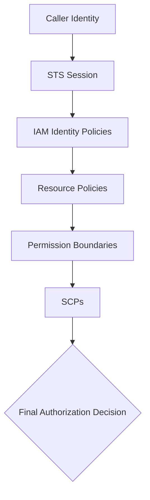

# Page 4 — AWS Identity Hierarchy

AWS identity and authorization follow a strict evaluation hierarchy.  
Every API request must pass through each layer to be allowed.

---

## 1. Identity Level — *Who is calling?*
The principal making the request can be:

- A human (via AWS SSO)
- An IAM role
- An AWS service (Lambda, EC2, ECS, Step Functions, etc.)
- A federated identity (OIDC, SAML)
- A cross-account principal

Identity defines the **actor**, but not its permissions or limits.

---

## 2. Session Level — *How did they authenticate?*
All modern AWS interactions use **STS temporary credentials**.

Session identity includes:
- Role session name  
- Session tags  
- MFA status  
- Source identity (OIDC token payload)  
- Session duration  

The session represents the authenticated context for authorization.

---

## 3. IAM Identity Policies — *What the principal is allowed to do*
IAM evaluates:
- Allow statements  
- Deny statements  
- Condition blocks  
- Action/Resource combinations  

Identity-based policies define permissions attached directly to:
- IAM roles  
- IAM users (rare)  
- IAM groups (legacy)

These are not final — several other layers must still approve the action.

---

## 4. Resource-Based Policies — *What the resource allows*
Some AWS services have policies attached *to the resource itself*:

- S3 Bucket Policy  
- KMS Key Policy  
- Lambda Resource Policy  
- API Gateway Resource Policy  
- EventBridge Event Bus Policy  
- SNS & SQS Access Policies  

These policies can:
- Allow cross-account access  
- Allow AWS services to invoke other services  
- Restrict identity access even if IAM identity policy allows it  

---

## 5. Permission Boundaries — *Maximum allowed permissions*
Boundaries limit permissions for:
- IAM roles  
- IAM users  

They do not grant permissions.  
They **cap** permissions granted elsewhere.

Used for:
- Developer sandbox accounts  
- CI/CD execution roles  
- Platforms where roles are created dynamically  

---

## 6. SCPs — *Organization-wide guardrails*
Service Control Policies apply at the AWS Organizations level.

SCPs can:
- Deny actions across **entire accounts or OUs**  
- Restrict region usage  
- Block dangerous IAM actions  
- Prevent disabling CloudTrail/Config  
- Enforce compliance and governance

If an SCP denies an action, **no IAM policy can override it.**

---

## 7. Identity Hierarchy Diagram



This hierarchy ensures that every request is evaluated through multiple independent layers of security.

---

## 8. Summary of Evaluation Logic

To allow an action:

```
SCPs must allow
Permission Boundaries must allow
Resource Policies must allow
IAM Policies must allow
AND there must be no explicit Deny anywhere
```

One deny overrides all allows.

AWS identity is intentionally multi-layered to enforce **Zero Trust** access control.

