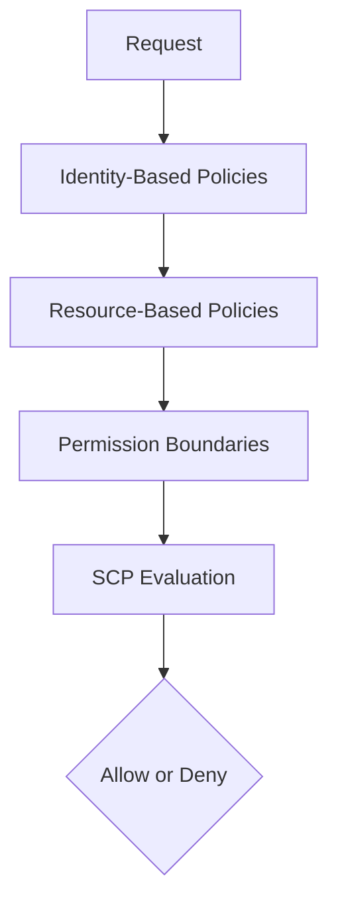

# Page 5 — IAM Policies (Deep Technical Breakdown)

## 1. IAM Policy Types
AWS has several distinct policy types, each serving a different purpose:

### **1. Identity-Based Policies**
Attached to:
- IAM roles  
- IAM users  
- IAM groups  

These policies define **permissions granted to the identity**.

### **2. Resource-Based Policies**
Attached directly to a resource, not an identity:
- S3 Bucket Policy  
- KMS Key Policy  
- Lambda Resource Policy  
- SNS/SQS Access Policy  
- API Gateway Resource Policy  
- EventBridge Bus Policy  

These policies define **who is allowed to access the resource**.

### **3. Permission Boundaries**
Define the **maximum permissions** an identity can ever have.
They do **not** grant permissions — they restrict them.

### **4. SCPs (Service Control Policies)**
Organization-wide allow/deny guardrails.

### **5. Session Policies**
Policies passed dynamically during `AssumeRole` calls.  
Used by:  
- STS session scoping  
- CI/CD pipelines  

These apply only for the **duration of the session**.

---

## 2. IAM Policy Structure

A typical IAM policy statement:

```json
{
  "Version": "2012-10-17",
  "Statement": [
    {
      "Sid": "ReadAccess",
      "Effect": "Allow",
      "Action": [
        "s3:GetObject",
        "s3:ListBucket"
      ],
      "Resource": "*"
    }
  ]
}
```

Fields:
- **Effect:** Allow or Deny  
- **Action:** The AWS API actions permitted or denied  
- **Resource:** ARNs targeted  
- **Condition:** Optional constraints  
- **Principal:** For resource policies only  

---

## 3. Explicit Deny Always Wins
IAM’s evaluation logic prioritizes:

```
Explicit Deny → Overrides everything
Allow → Only applies if no Deny exists
Default Deny → Anything not explicitly allowed is denied
```

This is foundational for Zero Trust and defense-in-depth.

---

## 4. Condition Keys
Conditions refine when policies apply.

Examples:
- MFA authentication  
- Source IP  
- Encryption requirements  
- Tags on a resource  
- Tags on the principal  
- VPC endpoint usage  
- Time-based restrictions  

Example:

```json
"Condition": {
  "Bool": {"aws:MultiFactorAuthPresent": "true"}
}
```

---

## 5. Resource Policies Enable Cross-Account Access
Example S3 bucket policy allowing another account:

```json
{
  "Effect": "Allow",
  "Principal": {"AWS": "arn:aws:iam::222222222222:root"},
  "Action": "s3:GetObject",
  "Resource": "arn:aws:s3:::my-bucket/*"
}
```

Identity policies **cannot** grant cross-account access — only resource policies can.

---

## 6. IAM Evaluation Flow Diagram



This flow applies to **every AWS API request**.

---

## 7. Common Policy Design Patterns

### **Least Privilege**
Grant only the actions and resources absolutely required.

### **Deny Guardrails**
Use explicit denies to:
- Prevent public S3 access  
- Block IAM changes  
- Disable use of root user  
- Enforce encryption  

### **Tag-Based Access Control**
IAM can use tags to define permissions:
- Access by “team”  
- Access by “environment”  
- Access by “data classification”

### **Session Scoping (CI/CD)**
CI/CD pipelines can pass session policies to reduce permissions temporarily.

---

## 8. Summary
IAM policies create the foundation of AWS authorization.  
Understanding:
- Identity policies  
- Resource policies  
- Conditions  
- Denies  
- SCPs  
- Boundaries  

…is essential for designing secure AWS architectures.

