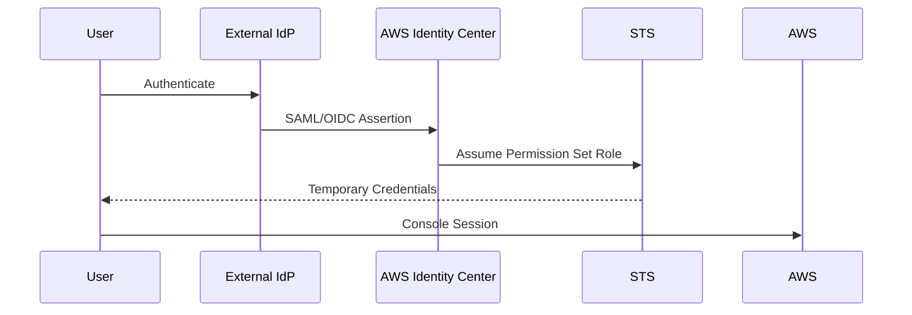
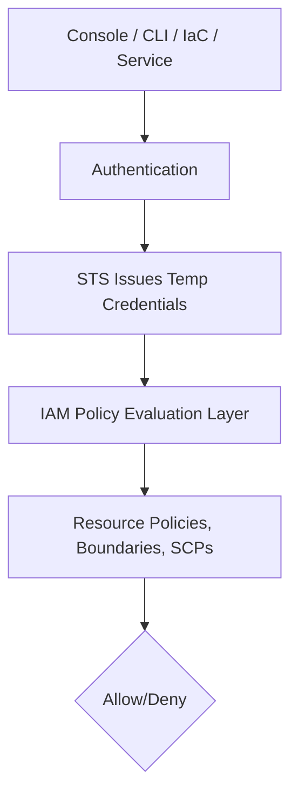

# Page 6 — Identity in Console, CLI, and IaC (Deep Dive)

Understanding how identity is applied across the **AWS Console**, **AWS CLI**, and **Infrastructure as Code (IaC)** is critical for securing authentication and authorization paths. Each access method uses AWS identity differently, even though all ultimately rely on **STS temporary credentials**.

---

# 1. Console Access — Human Authentication Path

AWS Console access is intended for human operators only.

### Authentication Flow
Most secure environments use:
- AWS Identity Center (formerly AWS SSO), or
- External IdPs (Okta, Entra ID, Google Workspace, Ping)

### Flow Diagram



### Key Properties
- Credentials are **temporary**
- Roles are assigned by **Permission Sets**
- MFA usually enforced at the IdP
- No IAM users required
- Centralized lifecycle management

---

# 2. CLI Access — STS Credential-Based Access

CLI access always uses **temporary credentials**, generated in one of three ways:

## 2.1 Console Credential Export
From AWS Console → “CLI Credentials”  
Used for temporary operator CLI sessions.

## 2.2 AWS SSO CLI (`aws sso login`)
The preferred method.

Flow:
```
aws sso login → browser auth → SSO → STS → ~/.aws/sso/cache → CLI session
```

## 2.3 AssumeRole (Cross-Account or Same Account)
A CLI user (human or machine identity) can assume an IAM role:

```
aws sts assume-role --role-arn arn:aws:iam::123:role/Admin --role-session-name test
```

### Result:
Temporary credentials:
- Access key  
- Secret key  
- Session token  
- Expiration  

---

# 3. IaC Access — Terraform, CloudFormation, CDK

IaC tools authenticate using the *same* identity mechanisms as CLI.

### 3.1 Terraform
Terraform gets credentials via:
- AWS SSO  
- AssumeRole  
- Static credentials (NOT recommended)  
- Profile switching  
- OIDC for CI/CD pipelines  

### 3.2 CloudFormation
CloudFormation uses the credentials of:
- The caller executing the operation, or
- The **Execution Role** defined in the stack

### 3.3 AWS CDK
CDK deploys by running CloudFormation behind the scenes, using:
- Bootstrap roles  
- Deploy roles  
- FileAsset and ImageAsset roles for S3/ECR publishing  

---

# 4. Identity Differences Between Console, CLI, and IaC

| Access Type | Auth Method | Identity Type | Credentials | Best Practice |
|-------------|-------------|---------------|-------------|----------------|
| Console | SSO / IdP | Human | Temp creds | No IAM Users |
| CLI | SSO / AssumeRole / OIDC | Human or machine | Temp creds | Use SSO or AssumeRole |
| Terraform | AssumeRole or OIDC | Machine | Temp creds | Never use static keys |
| CDK | Bootstrap roles | Machine/Human | Temp creds | Deploy via pipeline |
| CloudFormation | IAM Role (execution role) | Machine | Temp creds | Least privilege |

---

# 5. The Golden Rule: **ALL Paths → STS Temporary Credentials**

No matter the method:

- Human console access  
- CLI operations  
- Terraform deploys  
- CDK deployments  
- Lambda execution  
- ECS task execution  
- EKS IRSA pods  
- GitHub Actions OIDC access  

**All result in a principal authenticated via temporary STS credentials.**

### Unified Identity Flow



---

# 6. Summary — Identity Across Access Methods

### Console
- Always SSO → STS  
- Zero long-lived credentials  
- Human-only access path  

### CLI
- Either SSO or AssumeRole  
- Should never use persistent keys  

### IaC
- Prefer AssumeRole (pipeline→deploy role)  
- Never embed secrets  
- OIDC for CI/CD identity is the gold standard  

Identity is unified because AWS requires **temporary credentials** everywhere for secure, auditable, least-privilege access.

