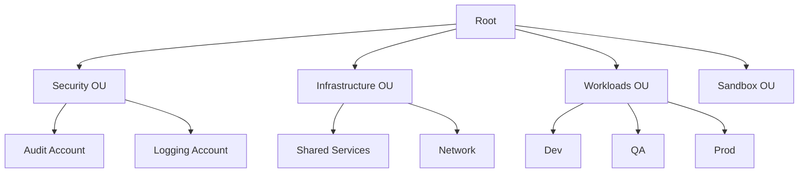

# Page 7 — AWS Organizations (Deep Dive)

AWS Organizations is the **governance and multi-account management layer** of AWS.  
It provides centralized control over accounts, identity guardrails, billing, region restrictions, and organization-wide security controls.

---

# 1. Why Organizations Exist

Enterprises use multiple AWS accounts for:

- Isolation of workloads  
- Security boundaries  
- Blast radius control  
- Cost allocation  
- Compliance segmentation  
- Least privilege at the account level  

Organizations lets you manage these accounts *as a fleet*.

---

# 2. Key Concepts

## **Master (Management) Account**
Used to:
- Create new AWS accounts  
- Apply billing controls  
- Create and apply SCPs  
- Integrate global security tools  

## **Organizational Units (OUs)**
OUs are logical groupings of accounts.

Common structure:

```
Root
 ├── Security
 │     ├── Logging
 │     └── Audit
 ├── Infrastructure
 │     ├── SharedServices
 │     └── Network
 ├── Workloads
 │     ├── Dev
 │     ├── QA
 │     └── Prod
 └── Sandbox
```

## **Accounts**
Each AWS account is a hard security boundary.

- IAM permissions cannot cross account boundaries without explicit trust  
- No role or resource is shared by default  
- Blast radius is contained  

---

# 3. Organization Structure Diagram



---

# 4. Centralized Security in Organizations

Organizations allows centralized enforcement of:

### **1. Mandatory Logging**
Use an account dedicated to:
- CloudTrail (organization trail)
- Config aggregation
- Access Analyzer
- Security Hub aggregation

### **2. SCP Enforcement**
Service Control Policies restrict:
- Regions  
- Services  
- IAM actions  
- Data exfiltration routes  
- Dangerous APIs (e.g., DisableCloudTrail)  

### **3. Central IAM Governance**
Identity Center (SSO) ties into Organizations:
- Automatic permission propagation  
- Account assignments  
- Central lifecycle management  

---

# 5. Automated Account Vending

Organizations enables automated account provisioning using:
- Control Tower  
- Terraform  
- Custom pipelines  
- Service Catalog  

New accounts come pre-configured with:
- Logging  
- Security tools  
- Network baselines  
- SCP guardrails  
- Zero Trust identity baselines  

---

# 6. Best Practices for AWS Organizations

### **1. Never put workloads in the management account**
It should only:
- Manage SCPs  
- Manage billing  
- Create accounts  

### **2. Use OUs for policy aggregation**  
Do not directly attach SCPs to individual accounts unless necessary.

### **3. Enforce region restrictions**
Helps compliance and reduces attack surface.

### **4. Use the Security OU for centralized monitoring**
No workloads, only guardrails.

### **5. Enforce least privilege across accounts**
Use IAM roles with explicit cross-account trust.

---

# 7. Organizations Summary
AWS Organizations is the backbone of enterprise-scale AWS management.

It provides:
- Multi-account governance  
- OU-based segmentation  
- SCP guardrails  
- Centralized logging and security  
- Account lifecycle automation  

It ensures AWS identity is managed at a scale consistent with Zero Trust principles.

