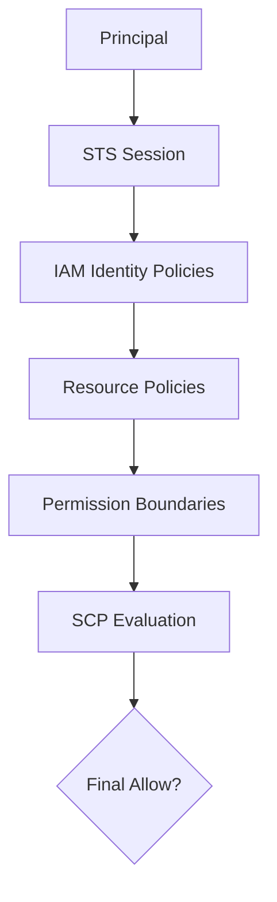

# Page 8 — Service Control Policies (SCPs)

Service Control Policies (SCPs) are **organization-wide guardrails** that control what AWS accounts *can* and *cannot* do — regardless of IAM permissions.

SCPs DO NOT:
- Grant permissions  
- Replace IAM  

SCPs DO:
- Restrict maximum available permissions  
- Enforce global governance  
- Prevent misconfigurations  
- Block dangerous or noncompliant actions  

---

# 1. SCP Evaluation Model

SCPs act as a **filter** before IAM policies.

Final authorization requires ALL of the following to allow an action:

```
SCPs allow
Permission Boundaries allow
Resource Policies allow
IAM Policies allow
NO explicit Deny exists
```

If an SCP denies an action, **nothing can override it** — not an admin role, not resource policies, not permission boundaries.

---

# 2. SCP Use Cases

## **1. Region Restrictions**
Block all regions except approved ones:

```json
{
  "Effect": "Deny",
  "Action": "*",
  "Resource": "*",
  "Condition": {
    "StringNotEquals": {
      "aws:RequestedRegion": ["us-east-1", "us-west-2"]
    }
  }
}
```

## **2. Deny Disabling Security Controls**
Prevent disabling:
- CloudTrail  
- GuardDuty  
- SecurityHub  
- Config  

```json
{
  "Effect": "Deny",
  "Action": [
    "cloudtrail:StopLogging",
    "cloudtrail:DeleteTrail"
  ],
  "Resource": "*"
}
```

## **3. Restrict IAM Mutations**
Block dangerous IAM operations:

```json
{
  "Effect": "Deny",
  "Action": [
    "iam:DeleteUser",
    "iam:DeleteRolePolicy",
    "iam:CreateAccessKey"
  ],
  "Resource": "*"
}
```

## **4. Enforce Tagging Standards**
Block resource creation without tags:

```json
{
  "Effect": "Deny",
  "Action": "ec2:RunInstances",
  "Resource": "*",
  "Condition": {
    "Null": {"aws:RequestTag/Owner": "true"}
  }
}
```

## **5. Prevent Public Access**
Example for S3:

```json
{
  "Effect": "Deny",
  "Action": ["s3:PutBucketAcl"],
  "Resource": "arn:aws:s3:::*",
  "Condition": {
    "StringEquals": {"s3:x-amz-acl": "public-read"}
  }
}
```

---

# 3. SCP Scope and Inheritance

SCPs apply to:
- The entire OU hierarchy  
- Child accounts  
- All IAM identities within those accounts  

SCPs do **not** apply to:
- The management (root) account  
- AWS services acting on your behalf  
- Service-linked roles (in some cases)

SCPs stack together — evaluations are cumulative.

---

# 4. SCP Diagram



---

# 5. Best Practices for SCPs

### **1. Start with Deny Lists**
Block only known-dangerous actions.

### **2. Move toward Full Governance**
Restrict entire regions, services, and data-exfiltration paths.

### **3. Apply SCPs at the OU level — not individual accounts**
Ensures propagation and consistency.

### **4. Avoid Allow-only SCPs**
“Allow lists” break AWS service functionality unless extremely well curated.

### **5. Always test SCPs in a non-prod OU first**
A mistake in SCPs *can lock out entire accounts*.

---

# 6. SCP Summary

SCPs are the strongest governance control in AWS Identity:
- Enforce security controls  
- Prevent misconfigurations  
- Restrict dangerous actions  
- Reduce attack surface  
- Ensure compliance across all accounts  

They are essential to Zero Trust and enterprise-scale AWS architecture.

